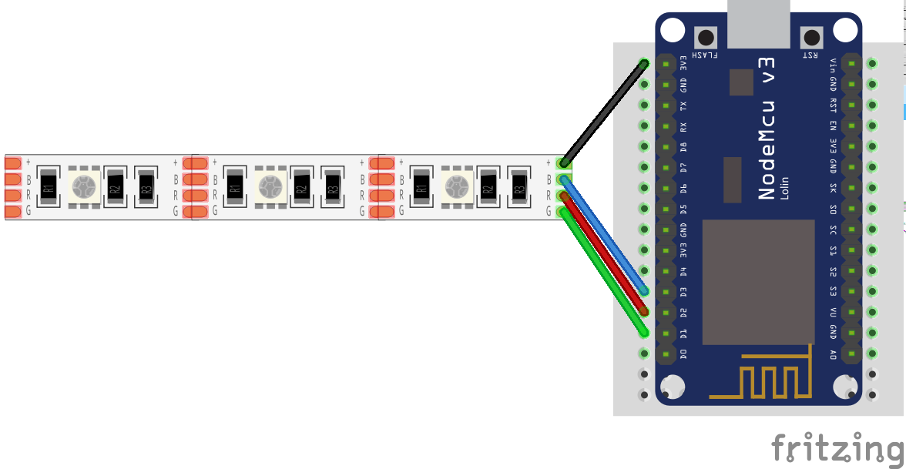
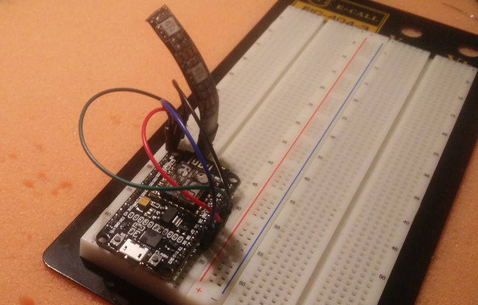
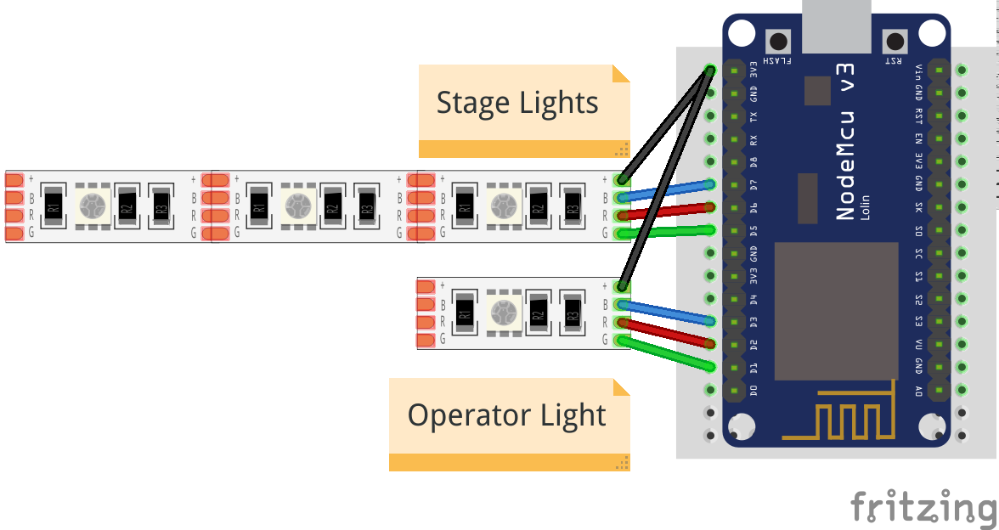

# Getting started

You need two parts to get the Tally Light operational: The Tally Lights themselves
and the Hub that connects your video mixer and the Tallies.

!TODO: graphic here! 

## Things you need

### a trusted network that allows access via WiFi
  
Your video mixer, the Hub and the Tallies need to be able to connect to each other.
You should take care that there is a close and stable WiFi hotspot near your Tallies
for obvious reasons. The network you are using should be trusted as all communication
is unencrypted.

The WiFi Chip supports `IEEE 802.11 b/g/n` and operates in the `2.4GHz` frequency band.
The Wifi network should support that as well.

### a computer to run the Hub on
  
The application is rather light weight, so there are no special requirements here
and it could run other applications in parallel. The Hub has a web interface for
monitoring and configuration that can be shown on any browser that can connect to
the computer.

To keep latency to a minimum it would be perfect if this computer uses a wired
connection.
  
### a NodeMcu ESP8266
  
This is an ESP8266 wifi chip on a development board that is typically used for IoT
applications. As it is an Open Hardware project there are lots of different boards
available. They mostly differ in price and form factor and are all fit for the project.
But they all look similar to this:


["NodeMCU Amica"](https://commons.wikimedia.org/wiki/File:Nodemcu_amica_bot_02.png) 
by "Make Magazin DE", [CC-BY-SA-4.0](https://creativecommons.org/licenses/by-sa/4.0/deed.en)

!TODO: elaborate on different NodeMCUs!
  
### a piece of RGB LED strip
  
It needs to be specified for 5V and have a common anode.
Most LED strips that can be separated after _every_ LED and have 4 pins should fulfill that requirement. 

I recommend taking one with 120LEDs per meter to not have the LEDS be spaced too much.

### an USB power source

The whole setup draws far less than `200mA` and can be powered via USB.

* Some cameras have USB outlets that you can use
* `200mA` is little enough that even the smallest power bank can supply the Tally for hours
* use any old USB charger

## Setup

Running the tally lights consists of two steps:

* **Setup the Tally Light** This means connecting the hardware and flashing the software onto it.

* **Setup the Hub** This is the piece of software that communicates with your video mixer and all
  connected Tallies and runs on any computer you provide.

### Download sources

The latest releases can be found on [github.com/wifi-tally]({{ github_link }}/releases).

### Setting up the Tally

#### Connect the hardware

All you need to do is connecting the LED strip to the NodeMCU board.

!!! warning
    Do not connect more than 5 LEDs to the board!
    
    This will drain too much current through the board and potentially damaging it.



| board PIN | strip PIN |
| --- | --- |
| D4 | B |
| D3 | R |
| D2 | G |
| 3V3 | + or +5V |

!!! info
    It is possible to connect the `+5V` pin of the LED strip to `Vin` on the board. But not all NodeMCU boards connect
    the PIN to the USB power supply and your LEDs would stay dark.
    
    It might also happen that you LED Strip does not work with a lower voltage of the 3.3V output. Typically this does
    not happen, but it could if you have an older strips.

This is how the setup could look like on a breadboard.



##### Separate Operator and Stage Light

You can connect a second strip to use as an indicator for the speaker on stage.
Connect the first LED as above and direct it in the direction of the camera operator.
Then connect a second strip and let it face to the front of the camera. 



| board PIN | strip PIN |
| --- | --- |
| D7 | B |
| D6 | R |
| D5 | G |
| 3V3 | + or +5V |

This light will only show preview and live states, but not any error states.
 
#### Prepare the NodeMCU Toolchain

The NodeMCU documentation very nicely explains all the steps necessary to [start a NodeMCU project](https://nodemcu.readthedocs.io/en/master/getting-started/#getting-started-aka-nodemcu-quick-start).
The documentation might seem overwhelming at first, but you only need to care of the two steps

* Flash Firmware, and
* Upload code

Depending on your Operating System, you should select one – and only one – [tool for each of these steps from
the table](https://nodemcu.readthedocs.io/en/master/getting-started/#task-os-selector).

So either select [NodeMCU PyFlasher](https://nodemcu.readthedocs.io/en/master/getting-started/#nodemcu-pyflasher)
or [esptool.py](https://nodemcu.readthedocs.io/en/master/getting-started/#esptoolpy) to flash the firmware
and follow their installation instruction. Similarly select [ESPlorer](https://nodemcu.readthedocs.io/en/master/getting-started/#esplorer)
or [NodeMCU Tool](https://nodemcu.readthedocs.io/en/master/getting-started/#nodemcu-tool) to upload code and follow
their installation instruction.

#### Flash the firmware

When everything is set up flash the firmware with the tool selected in the previous step.

The firmware is the `.bin` file in the `firmware` folder.

#### Upload Code

Use the tool you have selected to upload the following files from the `tally` folder to the NodeMCU board:

* every file ending in `.lc`
* `init.lua`
* the `tally-settings.ini` described below

!!! info "tally-settings.ini"
    This file configures your Tally. You can copy `tally-settings.ini.example` over and edit it as needed.

    | setting name | description | 
    | --- | --- |
    | `station.ssid` | The name of the WiFi that the Tally should connect to |
    | `station.password` | The password to connect to the WiFi. If the WiFi has no password, leave it empty. |
    | `hub.ip` | The IP address the hub is running on |
    | `tally.name` | How you want _this_ tally to be labeled in the hub. This name needs to be unique amongst all tallies in your network. It must not be longer than `26` characters. Use of ASCII characters is recommended. |

    For a list for all configuration values see [tally-settings.ini Reference](tally.md).

Reboot the NodeMCU board by pressing the `RST` button on the board or disconnecting it from power briefly.

!!! success
    If the LED strip starts blinking blue, this means you have correctly connected the hardware, flashed the firmware
    and uploaded the code.
    
    **Well done!** 

### Setting up the hub

The hub requires [node.js](https://nodejs.org/en/) to run. Packages for Linux, MacOS and even Windows
are offered on the [Download page](https://nodejs.org/en/download/). Get a fitting version.

Enter the `hub` directory and run

````bash
npm run start
````

!TODO: explain environment variables!

Point your browser to the IP of your computer on port {{ hub_default_port }}, for instance http://127.0.0.1:{{ hub_default_port }} if
you are on the same machine. You should see a screen similar to this


Your Tallies should also start popping up there. If not see the [Troubleshooting Guide](troubleshooting.md). 

Select `Configuration` in the navigation and configure the settings for your Video Mixer.

!!! info
    Currently only ATEM video mixers are supported, but please [open an issue](https://github.com/wifi-tally/wifi-tally/issues)
    if you want others to be supported too. It is really simple to integrate them
    and the only reason they have not been integrated yet, is that nobody has needed it already. :D

!!! info
    If you want to try this at home and don't have a Video Mixer at hand you can run
    `npm run dev` instead. It features a `Mock` Video Mixer that randomly switches channels.

Switch back to `Tallies` in the navigation and assign the video channels of the Video Mixer to the according
tallies.

!!! info
    The Tallies and their assigned channels are automatically saved in `.wifi-tally.json` in your home directory.
    So the configuration is restored when the Hub is restarted. 

!!! success
    Your Tallies should start showing green, when they are in Preview and red when they are in Program.
    
    Congratulations, you made it.
