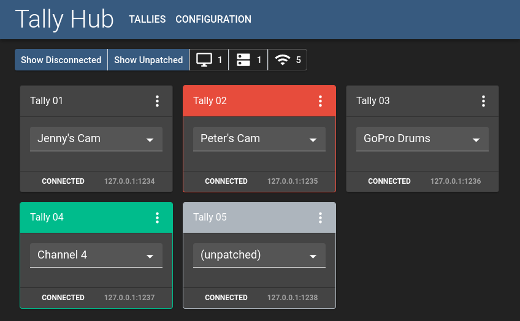

# Open Source Tally Light

Wifi Tally is an Open Source Wifi Tally Light based on the ESP8266.

It aims to be affordable without sacrificing reliability and works with most
common video mixers.

Its architecture uses a central Hub that connects the tallies to the video mixer and
allows easy configuration and monitoring.

uses icons from the Noun Project by 
[Eucalyp](https://thenounproject.com/browse/?i=3151803),
[Atif Arshad](https://thenounproject.com/browse/?i=1294543),
[Hrbon](https://thenounproject.com/browse?i=3014911) and
[ProSymbols](https://thenounproject.com/browse/?i=1086042), all licensed [CC-BY-3.0](https://creativecommons.org/licenses/by/3.0/us/legalcode)

## Features

* WiFi Tally Light based on the ESP8266
* Hardware costs of about 10€
* flexible USB power (battery pack, camera outlet, stationary)
* Fast communication and lightweight protocol
* uses a central Hub to communicate, that allows easy monitoring
* utilizes your local network and access points
* support for RGB Leds (anode, cathode), WS2812, NeoPixel, etc
* Open Source / Open Hardware

## Supported Video Mixers

* [Blackmagic Design ATEM](https://www.blackmagicdesign.com/products)
* [vMix](https://www.vmix.com/software/)

!!! info
    Please [open an issue](https://github.com/wifi-tally/wifi-tally/issues)
    if you want others to be supported too. It is really simple to integrate them
    and the only reason they have not been integrated yet, is that nobody has needed it already. :D

## Get Started

Refer to [Getting Started](getting-started.md) to start running your own Wifi Tally.

## Download

See the [download page](download.md).

